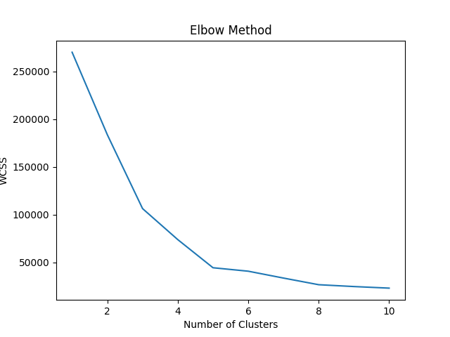
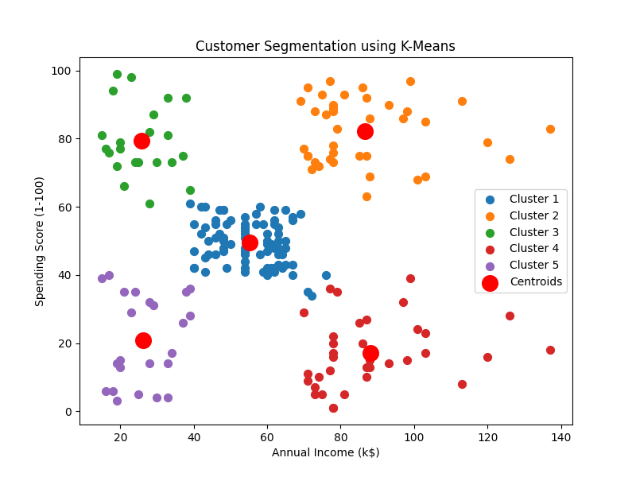

# Customer Segmentation using K-Means (Scikit-Learn)

## Overview

This project performs **Customer Segmentation** using the **K-Means Clustering Algorithm** implemented with **Scikit-Learn**.

Customer segmentation helps businesses divide their customers into meaningful groups based on their behavior. In this project, customers are segmented based on:

* **Annual Income**
* **Spending Score**

This allows businesses to understand customer purchasing patterns and create targeted marketing strategies.

---

## Dataset

The dataset used is the **Mall Customers Dataset**, containing **200 customer records**.

### Features

| Feature                | Description                                       |
| ---------------------- | ------------------------------------------------- |
| CustomerID             | Unique customer identifier                        |
| Gender                 | Customer gender                                   |
| Age                    | Age of customer                                   |
| Annual Income (k$)     | Annual income in thousand dollars                 |
| Spending Score (1–100) | Score assigned by mall based on spending behavior |

---

## Technologies Used

* Python
* Pandas
* Matplotlib
* Scikit-Learn
* VS Code

---

## Machine Learning Algorithm

### K-Means Clustering

K-Means is an **unsupervised learning algorithm** that groups data points into clusters based on similarity.

Steps used in this project:

1. Load and explore the dataset
2. Select relevant features for clustering
3. Use the **Elbow Method** to determine the optimal number of clusters
4. Train the **K-Means model**
5. Visualize customer segments
6. Assign cluster labels to customers
7. Export results to a new dataset

---

## Elbow Method

The **Elbow Method** helps determine the optimal number of clusters (k).

It works by plotting:

* Number of clusters (k)
* WCSS (Within Cluster Sum of Squares)

The point where the curve bends like an **elbow** indicates the best value of **k**.

In this project:

**Optimal clusters = 5**

---

## Customer Segments Identified

The algorithm groups customers into **five segments**:

| Cluster | Customer Type               |
| ------- | --------------------------- |
| 0       | Average Customers           |
| 1       | High Income – High Spending |
| 2       | Low Income – High Spending  |
| 3       | High Income – Low Spending  |
| 4       | Low Income – Low Spending   |

These segments help businesses identify **VIP customers, potential customers, and low-value customers**.

---

## Visualization

The project generates two graphs:

### 1️⃣ Elbow Method Graph

Determines the optimal number of clusters.

### 2️⃣ Customer Segmentation Scatter Plot

Displays clusters based on:

* Annual Income
* Spending Score

Each color represents a **different customer group**, and red points represent **cluster centroids**.

---

## Results

### Elbow Method



### Customer Segmentation




## Project Structure

```
Customer-Segmentation-ML
│
├── Mall_Customers.csv
├── Customer_Segmentation_Result.csv
├── kmeans_customer_segmentation.py
├── README.md
```

---

## Output

The program generates:

* Cluster visualization
* Cluster summary statistics
* A new dataset with customer segments

Example output file:

```
Customer_Segmentation_Result.csv
```

This file contains the assigned **cluster number** and **customer type** for each customer.

---

## Conclusion

K-Means clustering successfully identifies distinct groups of customers based on income and spending patterns. Businesses can use these insights to:

* Improve marketing strategies
* Target specific customer groups
* Increase sales and customer satisfaction

---

## Author

**Nihal V Srinivas**

(AI & Data Science Student)

